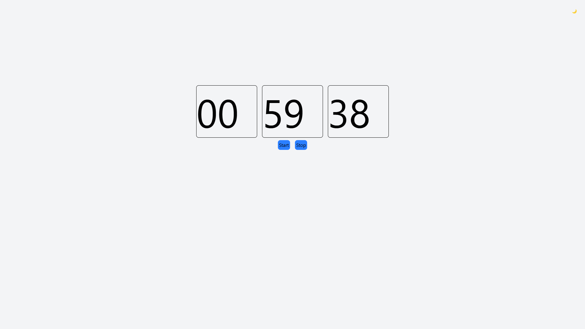

# timer-react

Timer created with React.

## Screenshots
Dark Theme:

<br>
Light Theme:

<br>
## Installation

Clone the repository:
    ```
    git clone https://github.com/pxiaccount/timer-react.git
    ```

1. Change directory in to client:

    ```bash
    cd timer-react
    ```

2. Install packages:

    ```bash
    npm i
    ```

3. Run the development server:

    ```bash
    npm run dev
    ```
